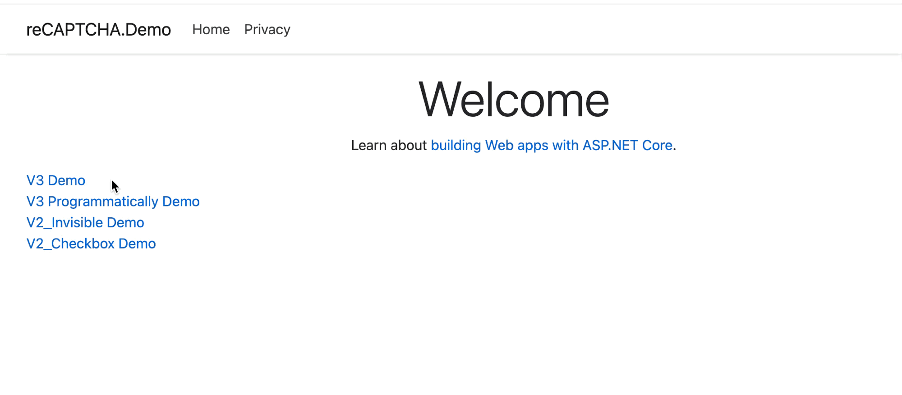
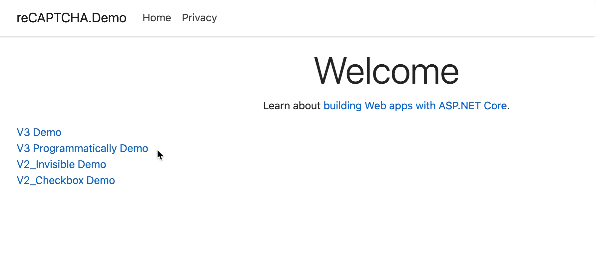
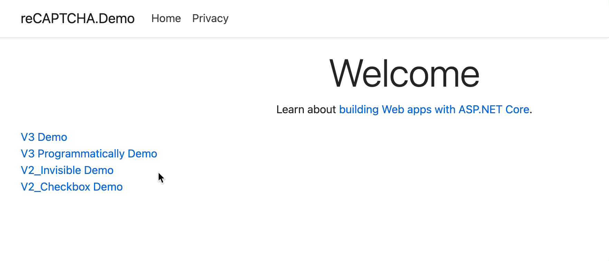
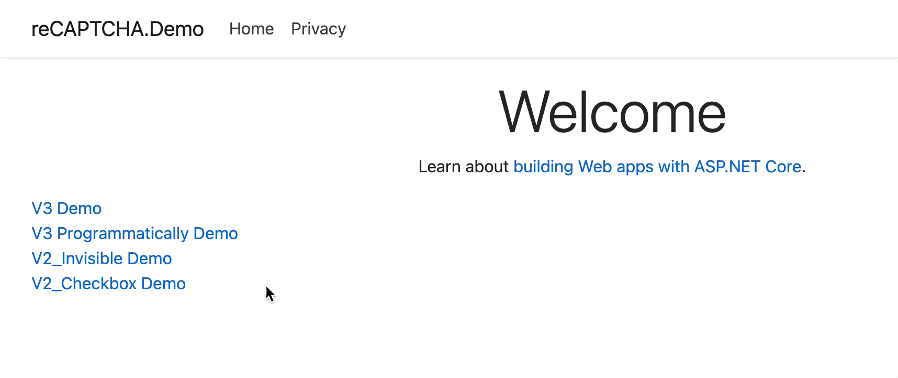

# Owl.reCAPTCHA
Google reCAPTCHA for ASP NET Core (v3 and v2)

# Demo

V3:



V3 Programmatically:



V2 Invisible:



V2 Checkbox:




# Install-Package

```
Install-Package Owl.reCAPTCHA
```

# reCAPTCHA v3

### v3 startup
```
services.AddreCAPTCHAV3(x =>
{
    x.SiteKey = "your_site_key";
    x.SiteSecret = "your_site_secret";
});
```

### v3 razor page

```
@addTagHelper *, Owl.reCAPTCHA

<form method="POST">
    <input id="token" name="token" type="text" />
    <input id="submit" type="submit" value="submit" />
</form>

<recaptcha-script-v3 />

@*
    Hide-the-recaptcha-badge
    https://developers.google.com/recaptcha/docs/faq#id-like-to-hide-the-recaptcha-badge.-what-is-allowed
    <recaptcha-script-v3 hide-badge="true" />
*@

<script>
    function callback(token) {
        document.getElementById("token").value = token;
    }
</script>

<recaptcha-script-v3-js action="login" callback="callback" />
```

```
@addTagHelper *, Owl.reCAPTCHA

<form method="POST" id="recaptchaForm">
    <input id="token" name="token" type="text" />
    <input id="submitBtn" type="submit" value="submit" />
</form>

<script>
    document.getElementById("submitBtn").onclick = function(e) {
        e.preventDefault();
        grecaptcha.reExecute(function(token) {
            document.getElementById("token").value = token;
            document.getElementById("recaptchaForm").submit();
        })
    };
</script>

<recaptcha-script-v3 />

@*
    Hide-the-recaptcha-badge
    https://developers.google.com/recaptcha/docs/faq#id-like-to-hide-the-recaptcha-badge.-what-is-allowed
    <recaptcha-script-v3 hide-badge="true" />
*@

<recaptcha-script-v3-js action="login" execute="false" />
```

### v3 razor page model

```
public class V3Model : PageModel
{
	private readonly IreCAPTCHASiteVerifyV3 _siteVerify;

	public V3Model(IreCAPTCHASiteVerifyV3 siteVerify)
	{
		_siteVerify = siteVerify;
	}

	public async Task OnPostAsync(string token)
	{
		var response = await _siteVerify.Verify(new reCAPTCHASiteVerifyRequest
		{
			Response = token,
			RemoteIp = HttpContext.Connection.RemoteIpAddress.ToString()
		});

        /*
        https://developers.google.com/recaptcha/docs/v3
        response:
        {
            "success": true|false,      // whether this request was a valid reCAPTCHA token for your site
            "score": number             // the score for this request (0.0 - 1.0)
            "action": string            // the action name for this request (important to verify)
            "challenge_ts": timestamp,  // timestamp of the challenge load (ISO format yyyy-MM-dd'T'HH:mm:ssZZ)
            "hostname": string,         // the hostname of the site where the reCAPTCHA was solved
            "error-codes": [...]        // optional
        }
        */
	}
}
```

# reCAPTCHA v2

### v2 startup
```
services.AddreCAPTCHAV2(x =>
{
    x.SiteKey = "your_site_key";
    x.SiteSecret = "your_site_secret";
});
```

### v2 razor page(checkbox mode)

```
@addTagHelper *, Owl.reCAPTCHA

<recaptcha-script-v2 />

<script>
    function callback(token) {
        document.getElementById("token").value = token;
    }
</script>

<form method="POST">
    <input id="token" name="token" type="text" />
    <input id="submit" type="submit" value="submit" />
</form>

<recaptcha-div-v2 callback="callback" />
```

### v2 razor page(invisible mode)

```
@addTagHelper *, Owl.reCAPTCHA

<script>
    function onload() {
        grecaptcha.execute();
    }

    function callback(token) {
        document.getElementById("token").value = token;
    }
</script>

<recaptcha-script-v2 onload="onload" />

@*
    Hide-the-recaptcha-badge
    https://developers.google.com/recaptcha/docs/faq#id-like-to-hide-the-recaptcha-badge.-what-is-allowed
    <recaptcha-script-v2 hide-badge="true" />
*@

<form method="POST">
    <input id="token" name="token" type="text" />
    <input id="submit" type="submit" value="submit" />
</form>

<recaptcha-div-v2 callback="callback" size="invisible" />
```

### v2 razor page(invisible mode)

```
@addTagHelper *, Owl.reCAPTCHA

<script>
    function callback(token) {
        document.getElementById("token").value = token;
        document.getElementById("demo-form").submit();
    }
</script>

<recaptcha-script-v2  />

@*
    Hide-the-recaptcha-badge
    https://developers.google.com/recaptcha/docs/faq#id-like-to-hide-the-recaptcha-badge.-what-is-allowed
    <recaptcha-script-v2 hide-badge="true" />
*@

<form id="demo-form" method="POST">
    <input id="token" name="token" type="text" />
    <button recaptcha-v2-callback="callback" recaptcha-v2-size="invisible">Submit</button>
</form>
```

### v2 razor page model

```
public class V2_CheckboxModel : PageModel
{
	private readonly IreCAPTCHASiteVerifyV2 _siteVerify;

	public V2_CheckboxModel(IreCAPTCHASiteVerifyV2 siteVerify)
	{
		_siteVerify = siteVerify;
	}

	public async Task OnPostAsync(string token)
	{
		var response = await _siteVerify.Verify(new reCAPTCHASiteVerifyRequest
		{
			Response = token,
			RemoteIp = HttpContext.Connection.RemoteIpAddress.ToString()
		});

        /*
        https://developers.google.com/recaptcha/docs/verify
        response:
        {
            "success": true|false,
            "challenge_ts": timestamp,  // timestamp of the challenge load (ISO format yyyy-MM-dd'T'HH:mm:ssZZ)
            "hostname": string,         // the hostname of the site where the reCAPTCHA was solved
            "error-codes": [...]        // optional
        }
        */
	}
}
```
